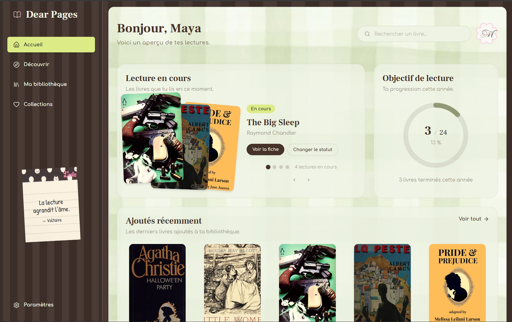
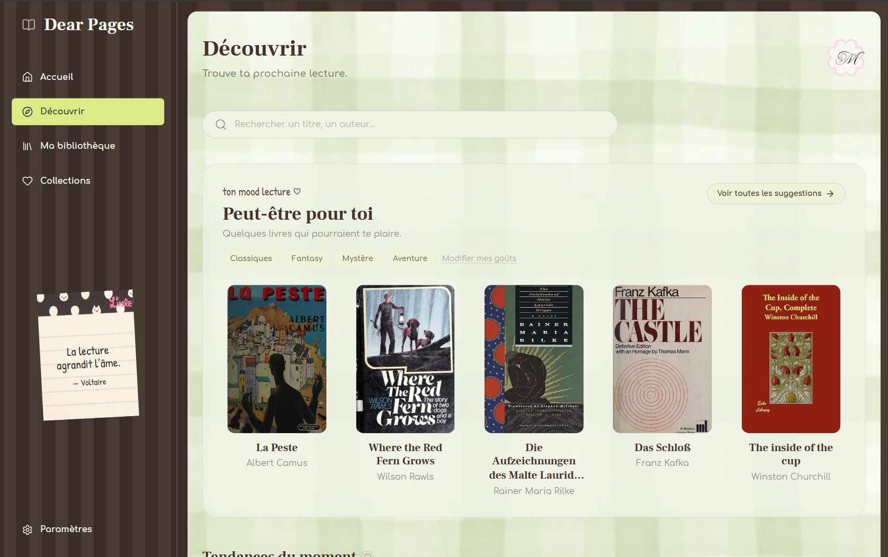
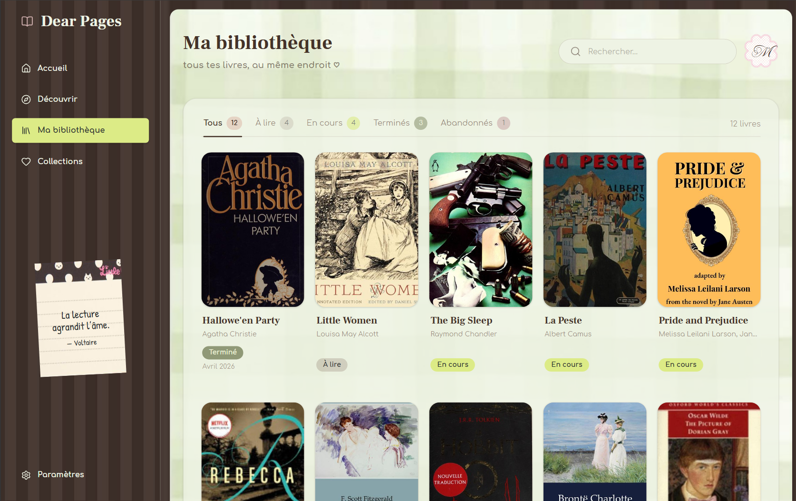
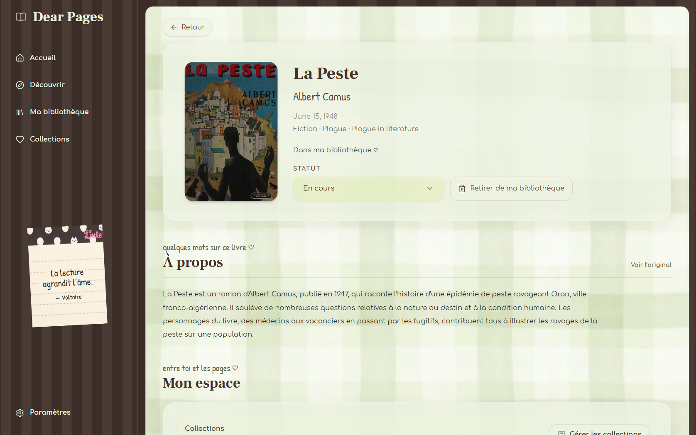
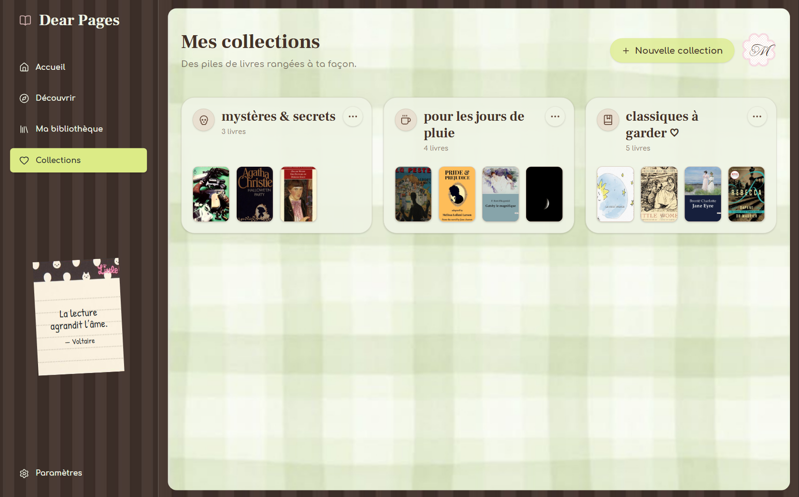
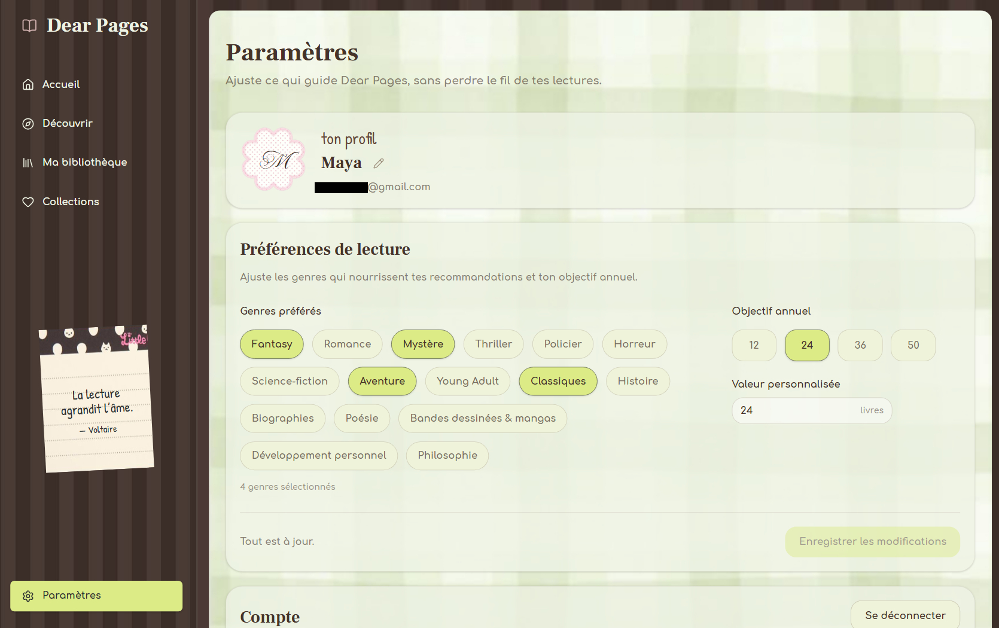

# Dear Pages ♡

> keep your reads close.  
> ₊˚⊹♡ a cozy little space for your books ♡⊹˚₊

Dear Pages is a cozy book tracking web app for
organizing your library, discovering new books,
tracking your reads, and keeping your favorite stories close. (˶ᵔ ᵕ ᵔ˶)

[Live app](https://dear-pages-booktracker.web.app) · [Documentation](https://dear-pages-docs.web.app)

---

## ✦ Features

♡ Create an account and sign in with email or Google

♡ Enjoy Dear Pages in French or English, with a language switcher available from authentication and Settings

♡ Personalize your experience through onboarding preferences

♡ Search for books by title, author, or keyword with live suggestions

♡ Discover personalized recommendations based on your favorite genres

♡ Browse trending books and timeless classics

♡ Open detailed book pages with information and descriptions translated into your selected language

♡ Build and organize your personal library

♡ Track books as To read, Reading, Finished, or Abandoned

♡ Add personal ratings, reviews, and notes to your books

♡ Create and organize custom book collections

♡ Keep track of your current reads and yearly reading goal from your dashboard

♡ Manage your profile and reading preferences in Settings

♡ Use Dear Pages across desktop, tablet, and mobile

---

## ✦ A little look inside

<table>
  <tr>
    <td width="50%">
      <strong>Dashboard</strong>  
      
    </td>
    <td width="50%">
      <strong>Discover</strong>  
      
    </td>
  </tr>
  <tr>
    <td width="50%">
      <strong>My Library</strong>  
      
    </td>
    <td width="50%">
      <strong>Book Page</strong>  
      
    </td>
  </tr>
  <tr>
    <td width="50%">
      <strong>Collections</strong>  
      
    </td>
    <td width="50%">
      <strong>Settings</strong>  
      
    </td>
  </tr>
</table>

---

## ✦ Made with

### Frontend

`React` · `JavaScript` · `Tailwind CSS` · `Vite` · `React Router`

`i18next` · `react-i18next`

### Backend & data

`Firebase Authentication` · `Cloud Firestore`

`Google Books API` · `Open Library API` · `Google Cloud Translation API`

### Testing & documentation

`Vitest` · `React Testing Library` · `Astro` · `Starlight`

### Deployment

`Firebase Hosting` · `GitHub Actions`

---

## ✦ Behind the pages

Dear Pages combines multiple book data sources to make discovery
and library tracking feel seamless.

Google Books provides the main book data and search experience,
while Open Library supports additional discovery and cover handling.
Book descriptions can be translated from different source languages
into French or English through Google Cloud Translation, depending
on the language selected by the user.

The interface supports both French and English through i18next,
with language preferences preserved across sessions.

Personal data ⸝ including library books, collections, ratings,
reviews, notes, preferences, and reading goals ⸝ is connected
to each authenticated user through Firebase.

The project includes automated tests with Vitest and dedicated
bilingual technical documentation built with Astro and Starlight.

---

## ✦ Language

Dear Pages is available in **French and English** ♡

You can choose your preferred language when signing in or creating
an account, and change it anytime from Settings.

Your language preference is saved, so Dear Pages feels like your
own little reading space every time you come back.

---

  made with ♡ one book at a time
   
  ᜊ ( ' - × ) ᜊ

